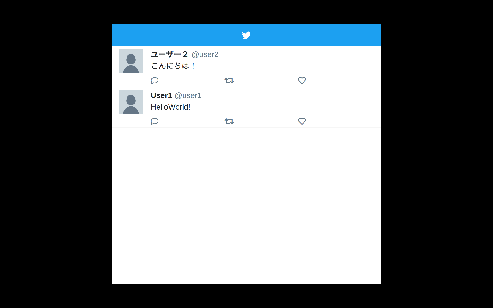

# Tweeter

ティラノスクリプト用Twitter風ウィンドウプラグイン



## 使い方

1. ティラノスクリプトの`data/others/plugin`フォルダに`tweeter`フォルダをコピーします
2. `first.ks`等で`[plugin name="tweeter"]`を呼びロードします
3. 使用したいところで`[create_tweeter top=... left=... width=... height=...]`を呼びウィンドウを作成します
4. ツイートを追加したいところで`[add_tweet name=... screen_name=... text=...]`を呼ぶことでウィンドウにツイートが追加されます
5. 不要になったら`[delete_tweeter]`を呼び、ウィンドウを削除します

### create_tweeter

Twitter風ウィンドウを表示します。

引数はゲームウィンドウ内でのpx単位で指定してください。

* `top`: px
* `left`: px
* `width`: px
* `height`: px
* `thema_color`: ナビゲーションバーの色（`#1ca0f1`）
* `logo_path`: ロゴ画像
* `border_radius`: ウィンドウの角を丸める（任意）※CSS`border-radius`参照
* `hide`: `true`指定でウィンドウ作成時に非表示にする（`show_tweeter`参照）

```
[create_tweeter top=0 left=660 width=300 height=640]
```

### add_tweet

ウィンドウにツイートを追加します。

* `name`: アカウント名
* `screen_name`: `@〜`に入るアカウント名（`@`は自動で付きます）
* `mode`: 先頭追加`"front"`(default) または 末尾追加`"back"`
* `id`: ツイートID （任意）

```
[add_tweet name="ユーザーネーム" screen_name="username" text="Hello World!" id="0001"]
```

### set_reply

ツイートを指定して返信数を更新します。

* `id`: `add_tweet`で指定した`id`
* `value`: 返信数

```
[set_reply id="0001" value="1"]
```

### set_retweet

ツイートを指定してリツイート数を更新します。

* `id`: `add_tweet`で指定した`id`
* `value`: リツイート数

```
[set_retweet id="0001" value="1"]
```

### set_favorite

ツイートを指定してお気に入り数を更新します。

* `id`: `add_tweet`で指定した`id`
* `value`: お気に入り数

```
[set_favorite id="0001" value="1"]
```

### remove_tweet

ツイートを指定して削除します。

* `id`: `add_tweet`で指定した`id`

```
[remove_tweet id="0001"]
```

### clear_tweet

ツイートを全削除します。

```
[clear_tweet]
```

### hide_tweeter

ウィンドウを非表示にします。

```
[hide_tweeter]
```

### show_tweeter

ウィンドウを再表示します。

```
[show_tweeter]
```

### delete_tweeter

ウィンドウを削除します。
（ツイートが消えます）

ウィンドウが存在しない場合は何もしないので、タイトル画面等で予防的に呼び出しても問題ありません。

```
[delete_tweeter]
```

## LICENSE

MIT License

### 3rdparty

* Font Awesome: MIT & SIL OFL 1.1 License
* Bootstrap: MIT License
* Twitter Logo（サンプル用）: https://about.twitter.com/ja/company/brand-resources.html
